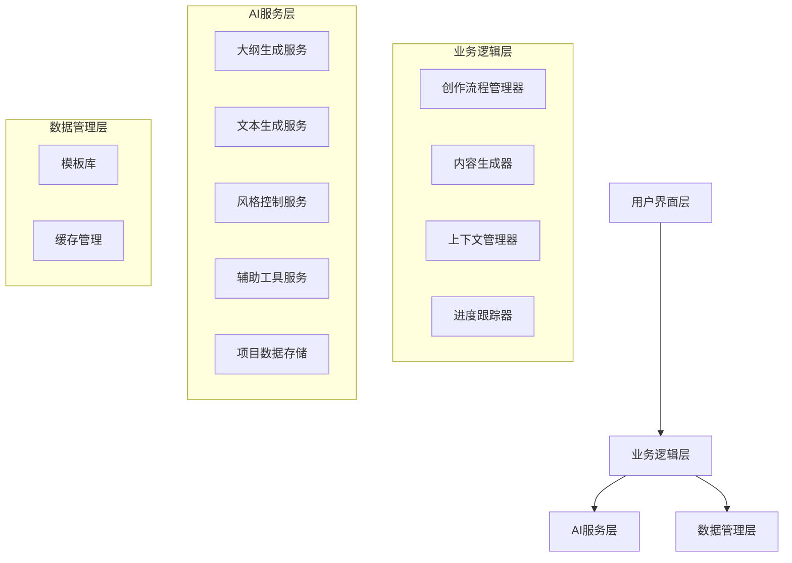
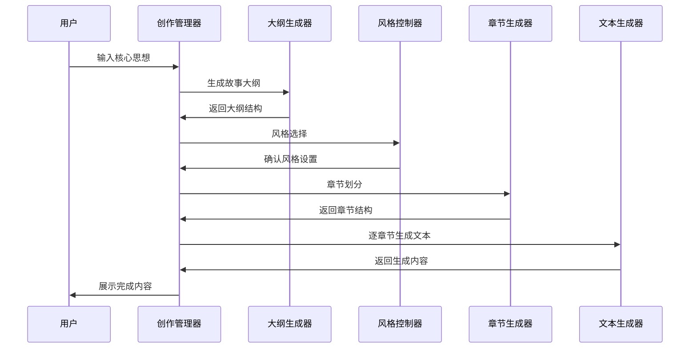

# 设计文档

## 概述

小说创作助手是一个基于AI的智能写作工具，采用模块化架构设计，通过多个专门的处理模块协同工作，将用户的核心创意转化为完整的长篇小说。系统支持多模态输入（文字和图片），采用渐进式生成策略，有效管理上下文窗口限制，确保100万字长篇小说的连贯性和质量。

## 架构

### 整体架构



### 核心处理流程



## 组件和接口

### 1. 创作流程管理器 (CreationFlowManager)

负责整个创作流程的协调和状态管理。

```typescript
interface CreationFlowManager {
  // 初始化创作项目
  initializeProject(coreIdea: string): Promise<Project>
  
  // 执行创作流程步骤
  executeStep(step: CreationStep): Promise<StepResult>
  
  // 获取当前状态
  getCurrentState(): CreationState
  
  // 保存项目进度
  saveProgress(): Promise<void>
}

interface Project {
  id: string
  coreIdea: string
  outline: Outline
  style: WritingStyle
  chapters: Chapter[]
  currentWordCount: number
  targetWordCount: number
  createdAt: Date
  updatedAt: Date
}
```

### 2. 大纲生成器 (OutlineGenerator)

基于核心思想生成详细的故事大纲。

```typescript
interface OutlineGenerator {
  // 生成初始大纲
  generateOutline(coreIdea: string): Promise<Outline>
  
  // 扩展大纲细节
  expandOutlineSection(section: OutlineSection): Promise<OutlineSection>
  
  // 验证大纲完整性
  validateOutline(outline: Outline): ValidationResult
}

interface Outline {
  mainTheme: string
  characters: Character[]
  worldSetting: WorldSetting
  plotStructure: PlotStructure
  conflicts: Conflict[]
}
```

### 3. 风格控制器 (StyleController)

管理写作风格的选择和应用。

```typescript
interface StyleController {
  // 获取可用风格选项
  getAvailableStyles(): WritingStyle[]
  
  // 应用选定风格
  applyStyle(style: WritingStyle): void
  
  // 验证文本风格一致性
  validateStyleConsistency(text: string): StyleValidationResult
}

interface WritingStyle {
  id: string
  name: string
  description: string
  characteristics: StyleCharacteristics
  examples: string[]
}
```

### 4. 章节管理器 (ChapterManager)

处理章节划分和结构管理。

```typescript
interface ChapterManager {
  // 自动划分章节
  divideIntoChapters(outline: Outline): Chapter[]
  
  // 调整章节结构
  adjustChapterStructure(chapters: Chapter[]): Chapter[]
  
  // 验证章节长度
  validateChapterLength(chapter: Chapter): boolean
}

interface Chapter {
  id: string
  title: string
  summary: string
  keyPlotPoints: PlotPoint[]
  requiredElements: string[]
  estimatedWordCount: number
  actualWordCount: number
  content: string
  status: ChapterStatus
}
```

### 5. 文本生成器 (TextGenerator)

核心的文本生成组件。

```typescript
interface TextGenerator {
  // 生成章节内容
  generateChapterContent(chapter: Chapter, context: GenerationContext): Promise<string>
  
  // 续写文本
  continueText(existingText: string, requirements: string[]): Promise<string>
  
  // 优化文本质量
  refineText(text: string): Promise<string>
}

interface GenerationContext {
  previousChapters: Chapter[]
  characterStates: CharacterState[]
  worldState: WorldState
  style: WritingStyle
  constraints: GenerationConstraints
}
```

### 6. 上下文管理器 (ContextManager)

管理长文本创作中的上下文窗口。

```typescript
interface ContextManager {
  // 压缩历史内容
  compressHistory(content: string[]): string
  
  // 提取关键信息
  extractKeyInformation(text: string): KeyInformation
  
  // 管理上下文窗口
  manageContextWindow(currentContext: string, newContent: string): string
}
```

### 7. 多模态处理器 (MultimodalProcessor)

处理文字和图片输入的多模态内容。

```typescript
interface MultimodalProcessor {
  // 处理图片输入
  processImageInput(image: ImageInput): Promise<ImageAnalysisResult>
  
  // 将图片描述转换为情节要求
  convertImageToPlotRequirement(analysis: ImageAnalysisResult): PlotRequirement
  
  // 处理混合输入（文字+图片）
  processMixedInput(textInput: string, imageInputs: ImageInput[]): Promise<PlotRequirement>
  
  // 验证图片内容适用性
  validateImageContent(image: ImageInput): ValidationResult
}

interface ImageInput {
  id: string
  file: File
  description?: string
  metadata: ImageMetadata
}

interface ImageAnalysisResult {
  description: string
  elements: VisualElement[]
  mood: string
  setting: string
  characters: string[]
  actions: string[]
  emotions: string[]
}

interface PlotRequirement {
  id: string
  type: 'text' | 'image' | 'mixed'
  content: string
  visualElements?: VisualElement[]
  priority: number
  chapterHint?: string
}
```

## 数据模型

### 核心数据结构

```typescript
// 角色模型
interface Character {
  id: string
  name: string
  description: string
  personality: string[]
  background: string
  relationships: Relationship[]
  developmentArc: string
}

// 世界设定
interface WorldSetting {
  timeperiod: string
  location: string
  socialContext: string
  rules: string[]
  atmosphere: string
}

// 情节结构
interface PlotStructure {
  exposition: string
  risingAction: PlotPoint[]
  climax: string
  fallingAction: PlotPoint[]
  resolution: string
}

// 冲突设定
interface Conflict {
  type: ConflictType
  description: string
  participants: string[]
  resolution: string
}
```

## 错误处理

### 错误类型定义

```typescript
enum ErrorType {
  VALIDATION_ERROR = 'VALIDATION_ERROR',
  GENERATION_ERROR = 'GENERATION_ERROR',
  CONTEXT_OVERFLOW = 'CONTEXT_OVERFLOW',
  STYLE_INCONSISTENCY = 'STYLE_INCONSISTENCY',
  STORAGE_ERROR = 'STORAGE_ERROR'
}

interface ErrorHandler {
  handleError(error: CreationError): ErrorResponse
  recoverFromError(error: CreationError): Promise<RecoveryResult>
}
```

### 错误处理策略

1. **验证错误**：提供具体的修改建议，引导用户调整输入
2. **生成错误**：自动重试机制，降级到简化生成模式
3. **上下文溢出**：智能压缩历史内容，保留关键信息
4. **风格不一致**：自动风格校正，提醒用户确认
5. **存储错误**：本地缓存机制，确保数据不丢失

## 测试策略

### 单元测试

- 各个组件的独立功能测试
- 数据模型验证测试
- 错误处理逻辑测试

### 集成测试

- 创作流程端到端测试
- 组件间接口测试
- 数据一致性测试

### 性能测试

- 大文本生成性能测试
- 上下文管理效率测试
- 并发处理能力测试

### 质量测试

- 生成文本质量评估
- 风格一致性验证
- 情节连贯性检查

## 技术实现考虑

### 上下文窗口管理

1. **分层压缩策略**：
   - 保留最近的详细内容
   - 中期内容进行摘要压缩
   - 早期内容提取关键信息点

2. **智能内容选择**：
   - 优先保留角色发展信息
   - 保持情节线索的连续性
   - 维护世界设定的一致性

### 风格一致性保证

1. **风格模板系统**：预定义多种写作风格的特征模板
2. **实时风格检查**：在生成过程中持续验证风格一致性
3. **风格学习机制**：从用户反馈中学习和调整风格应用

### 网络小说适配

1. **章节长度控制**：每章2000-4000字，适合网络阅读
2. **悬念设置**：章节结尾自动添加悬念元素
3. **节奏控制**：平衡叙述、对话、动作的比例

### 多模态输入处理

1. **图片分析流程**：
   - 图片上传和预处理（格式转换、尺寸优化）
   - 视觉内容识别（场景、人物、物体、情绪）
   - 文本描述生成（将视觉元素转换为文字描述）
   - 情节要求提取（从视觉内容推导故事元素）

2. **图片与文字融合**：
   - 优先级处理：文字输入为主，图片作为补充
   - 冲突解决：当图片内容与文字描述冲突时的处理策略
   - 上下文整合：将图片分析结果融入章节上下文

3. **支持的图片类型**：
   - 场景图片：用于描述故事背景和环境
   - 人物图片：用于角色外貌和特征描述
   - 情绪图片：用于表达特定的情感氛围
   - 动作图片：用于描述具体的情节动作

### 性能优化

1. **异步处理**：大文本生成采用异步处理，避免界面阻塞
2. **缓存机制**：缓存生成的中间结果，支持快速修改和重生成
3. **增量生成**：支持章节级别的独立生成和修改
4. **图片处理优化**：
   - 图片压缩和格式优化
   - 批量图片处理
   - 图片分析结果缓存